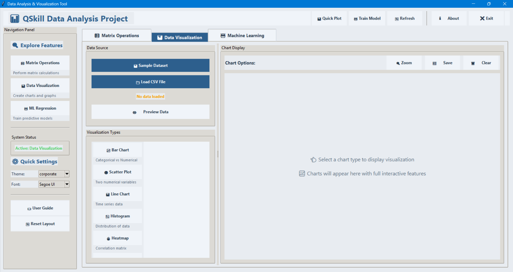
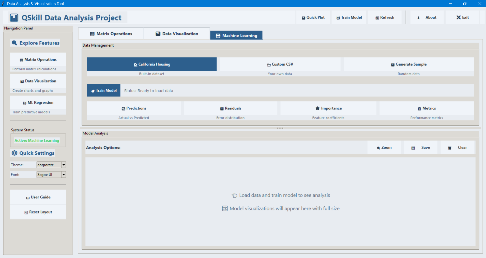

<p align="center">
  
</p>


# 📊 Data Analysis & Visualization Tool  


A **professional-grade desktop application** built using **Python and Tkinter**, designed to combine **matrix computation, data analysis, visualization, and machine learning** into a single, powerful platform.  
The application features a **modern neumorphic UI**, delivering an intuitive and visually appealing user experience.


## 🚀 Key Highlights  

### 🧮 Matrix Operations Suite  
Perform high-performance matrix computations powered by **NumPy**, including:  
 • Matrix Addition & Subtraction  
 • Matrix Multiplication  
 • Transpose  
 • Determinant Calculation  
 • Automatic dimension validation  


### 📈 Advanced Data Visualization  
Generate meaningful insights through a dedicated visualization module:

**Statistical Visuals**
 • Histograms  
 • Box Plots  
 • Heatmaps (Correlation Matrix)  

**Relational Visuals**
 • Scatter Plots  
 • Line Charts  

**Categorical Visuals**
 • Bar Charts  
 • Pie Charts  

The tool intelligently detects **numeric and categorical columns** to ensure accurate plotting.


### 🤖 Machine Learning – Linear Regression  
Build and evaluate predictive models seamlessly:
 • Supports **California Housing Dataset** and custom CSV files  
 • Automated feature scaling using **StandardScaler**  
 • Performance visualizations including:
   • Actual vs Predicted plots  
   • Residual analysis  
   • Feature importance visualization  


### 🎨 Modern & Customizable UI  
 • Neumorphic design for a professional appearance  
 • Theme options: **Corporate**, **Light**, and **Dark**  
 • Dynamic font scaling for improved accessibility  


## 🛠️ Technology Stack  
-------------------------------------------------------
|      Category        |           Tools              |
|----------------------|------------------------------|
| Programming Language | Python 3.x                   |
| GUI Framework        | Tkinter (ttk themed widgets) |
| Data Processing      |   Pandas, NumPy              |
| Machine Learning     | Scikit-learn                 |
| Visualization        | Matplotlib, Seaborn          |
-------------------------------------------------------

## 📂 Project Structure  

Project
│
├── gui_app.py            # Core application logic and GUI implementation
├── requirements.txt      # Project dependencies
├── README.md             # Project documentation
└── screenshots/
    ├── dashboard.png
    ├── matrix_operations.png
    ├── data_visualization.png
    └── linear_regression.png


## 📸 Application Screenshots

### 🏠 Main Dashboard


### 🧮 Matrix Operations Module


### 📊 Data Visualization Module


### 🤖 Linear Regression & Predictions



## 📸 Application Demo : 


## ⚙️ Installation & Usage  

1️⃣ Clone the Repository  
```bash 
git clone https://github.com/your-username/data-analysis-tool.git
cd data-analysis-tool

2️⃣ Install Dependencies
```bash 
pip install numpy pandas matplotlib seaborn scikit-learn

3️⃣ Run the Application
```bash 
python gui_app.py

📘 User Guide
🔢 Matrix Operations

   • Enter matrix dimensions first

   • Input matrix data row-wise

   • The application validates dimensions before processing


📊 Data Visualization

   • Load a CSV file

   • Automatic detection of numerical and categorical columns

   • Select chart type and generate visuals instantly


📉 Linear Regression

   • Ensure the dataset contains numerical features

   • Select the Target Column (dependent variable)

   • Train the model and analyze predictions and residuals


👤 Author

Vikash Ramdarash Chaurasiya
🎓 MCA Student
🏫 Thakur Institute of Management Studies, Career Development & Research (TIMSCDR)


🔗 References & Official Documentation

   • Python Documentation: https://docs.python.org/3/

   • Tkinter Documentation: https://docs.python.org/3/library/tkinter.html

   • NumPy Documentation: https://numpy.org/doc/

   • Pandas Documentation: https://pandas.pydata.org/docs/

   • Scikit-learn Documentation: https://scikit-learn.org/stable/documentation.html

   • Matplotlib Documentation: https://matplotlib.org/stable/index.html

   • Seaborn Documentation: https://seaborn.pydata.org/

